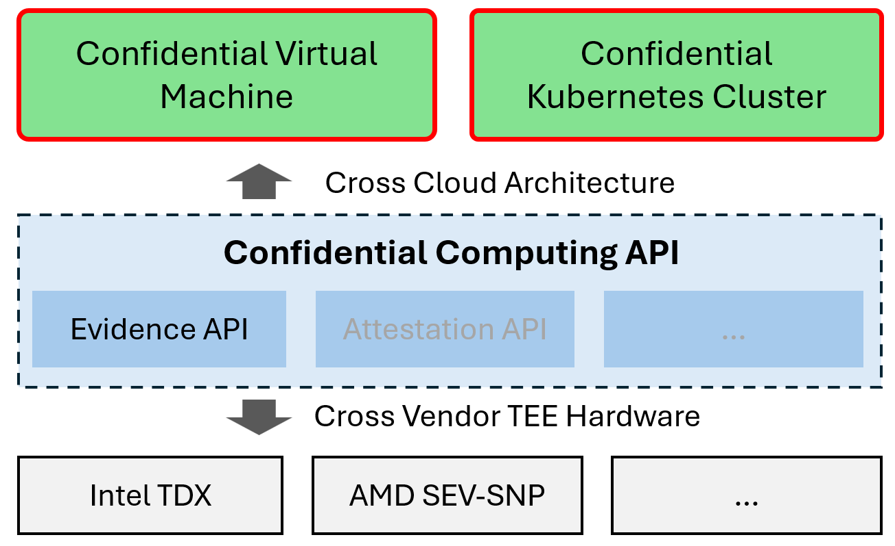
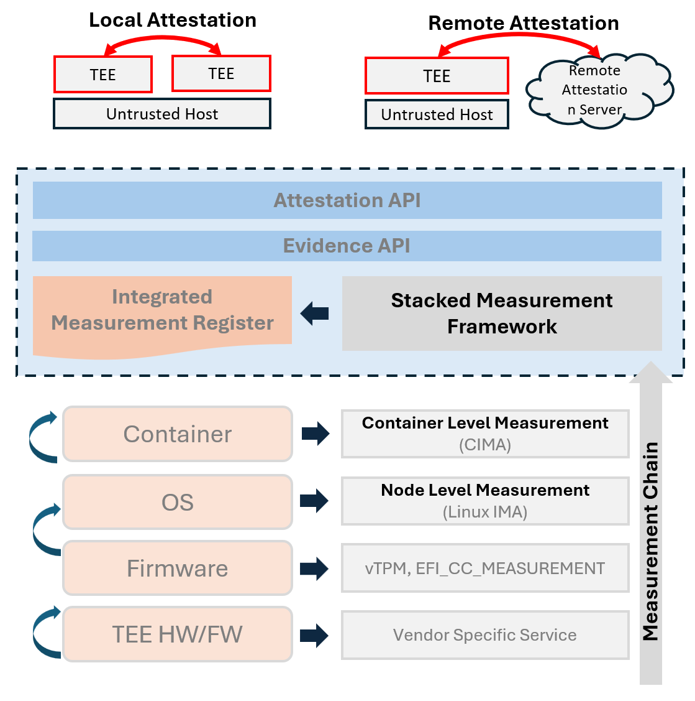
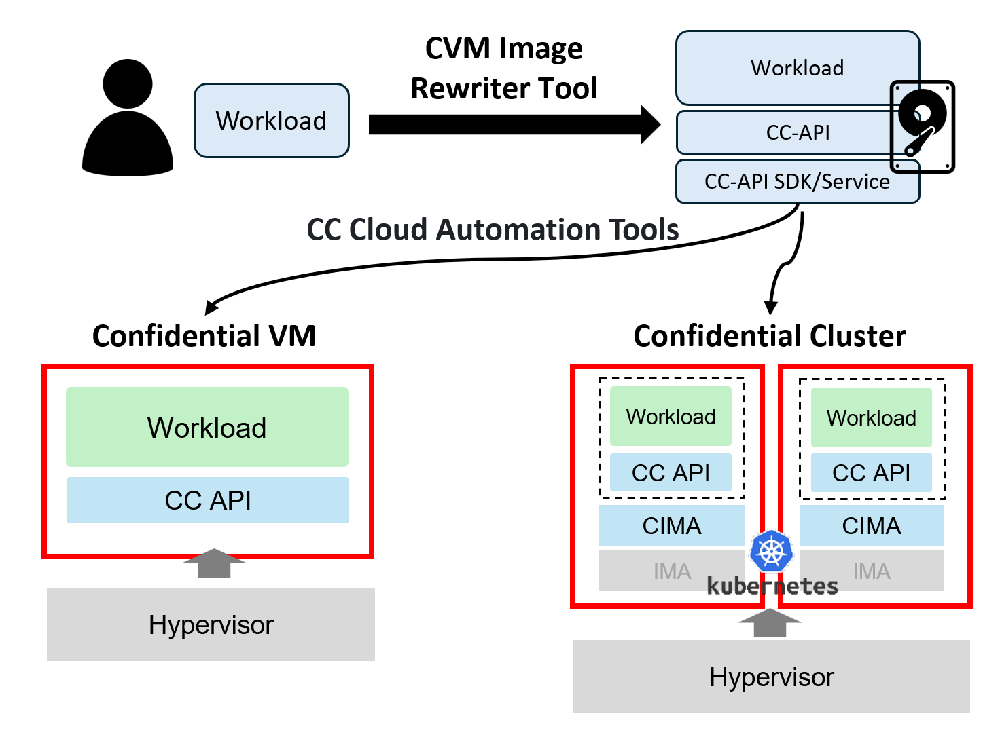
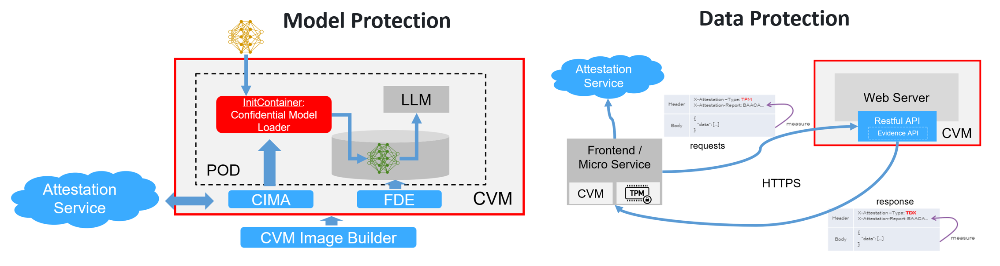

# Welcome to Confidential Computing API Group

The CC (Confidential Computing) API Group is a community to accelerate the adoption of confidential computing technology in cloud environments. It serves as a central gathering place for specs, code, documentation, and ideas.

Welcome to contribute efforts for a common goal of confidential computing technology adoption!

## Goals

1. Define **unified and vendor agnostic APIs** to collect evidences cross cloud architecture which can be found in the [spec](https://docs.google.com/document/d/1nO0y3GgnUKGBG7VEwGfzc6ndhArGzWFcULhYEb0-zrg/edit) and [evidence-api](https://github.com/cc-api/evidence-api). Welcome to propose and define more APIs.

    

        
    

    _NOTE:_
    - Please get detail [confidential use cases](Confidential computing use cases
) for confidential virtual machine (CVM), confidential workload (CW), confidential containers (CCn), confidential cluster (CCl).
    - Confidential Container is ignored here, because it can be regarded as "Confidential VM" from the perspective of measurement and attestation. And Confidential Container is not a good and recommended deployment type for a scalable kubernetes environment.

2. Provide **stacked measurement frameworks** to gether [node level evidence](https://github.com/cc-api/cc-trusted-vmsdk) and [container level evidence](https://github.com/cc-api/container-integrity-measurement-agent) for workloads. The evidence can be used to complete remote attestation or other verification based on the business needs.

    

        
    

3. Provide **easy-to-use tools** and examples of building trust chain in multiple deloyment flavors of confidential computing environments.

    

        
    

    _NOTE:_
    - [CVM Image Rewriter](https://github.com/cc-api/cvm-image-rewriter) - Create and customize the confidential VM's qcow2 image including IMA policy, initrd, device permission etc.
    - [CC Cloud Automation](https://github.com/cc-api/cc-cloud-automation) - Automation framework & tools which supporting diverse confidential cloud flavors like confidential VM/cluster/container/FaaS etc.

4. Provide the reference design of **confidential AI/GenAI loader** on model/data protections.

    

        
    

## Getting Started

### Use Case 1: Node Level Measure in Confidential VM

1. Create a confidential VM on Google or Azure:
    - Google GKE: [N2D(AMD EPYC)](https://cloud.google.com/compute/docs/general-purpose-machines#n2d_machines)/[C3(Intel Sapphire Rapids)](https://cloud.google.com/compute/docs/general-purpose-machines#c3_series)
    - Azure AKS: DCasv5/ECasv5(AMD), [DCesv5/ECesv5(Intel)](https://learn.microsoft.com/en-us/azure/virtual-machines/ecesv5-ecedsv5-series)
2. Run [cc-measure](https://github.com/cc-api/cc-measure) tool in CVM
3. Evaluate the [node measurement log](https://github.com/cc-api/evidence-api/blob/main/docs/vmsdk-eventlog-sample-output-with-IMA.txt)

### Use Case 2: Container Level Measure in Confidential Cluster

Please refer [Container Measurement Quick Start](https://github.com/cc-api/container-integrity-measurement-agent/blob/main/deployment/README.md) - how to prepar a CVM guest image, create a CVM and gather measurement, eventlogs for containers.

### More

Please find more introduction to the repositories [here](https://github.com/cc-api/community/blob/main/repository.md).

## Join the community

- Slack - Join `CC API` [slack channel](https://cc-api.slack.com/archives/C0708HZ9087).

## Community Meetings

- Welcome to join the community meetings. The meeting calendar and agenda can be found [here](https://github.com/cc-api/community/blob/main/meetings/README.md).

## More Information

- [Evidence API Introduction](https://github.com/cc-api/evidence-api/wiki)
- [Container Measurement Design](https://github.com/cc-api/container-integrity-measurement-agent/blob/main/docs/container-measurement-design.md)
- [Container Measurement Architecture](https://github.com/cc-api/container-integrity-measurement-agent)
- [Community Activities](https://github.com/cc-api/.github/blob/main/profile/community.md)
